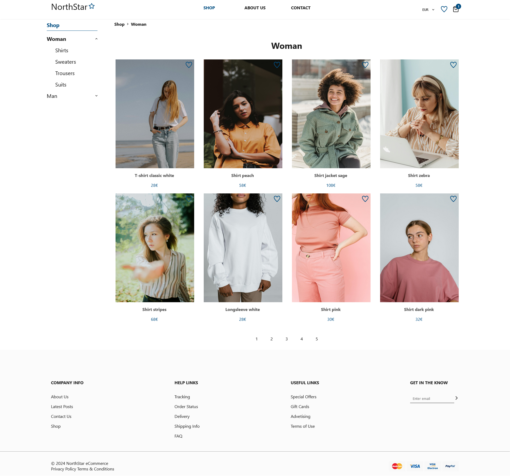
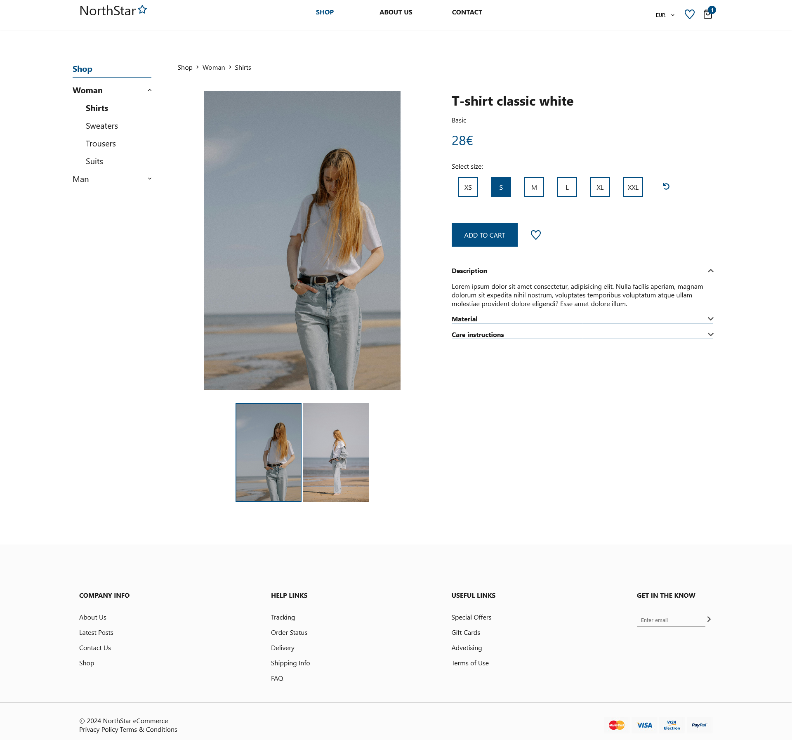
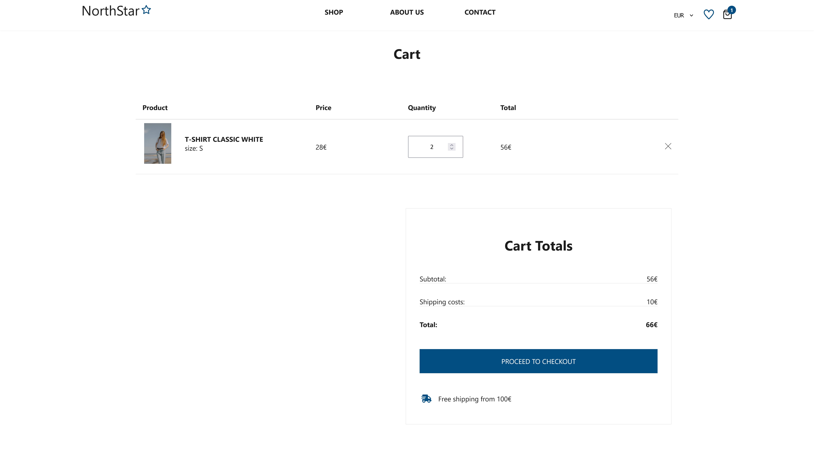

# NorthStar - E-commerce website

This shop was created with Vite+React.

## Technologies

<p align="left">
<a href="https://react.dev/"></a>
<a href="https://developer.mozilla.org/en-US/docs/Web/CSS?retiredLocale=pl"></a>
<a href="https://developer.mozilla.org/en-US/docs/Web/JavaScript"></a>

## About the project

## Screenshot

### Home Page

  <p align="center">
  
  </p>

### Product Details

  <p align="center">
  
  </p>

### Favourites

<p align="center">
  
  </p>

### Favourites

<p align="center">
  
  </p>

## Installation

To run this project, you must have the following dependencies installed:

- Git (https://git-scm.com)

```bash

git clone https://github.com/lilunia/NorthStar.git
npm install
npm run dev

```
